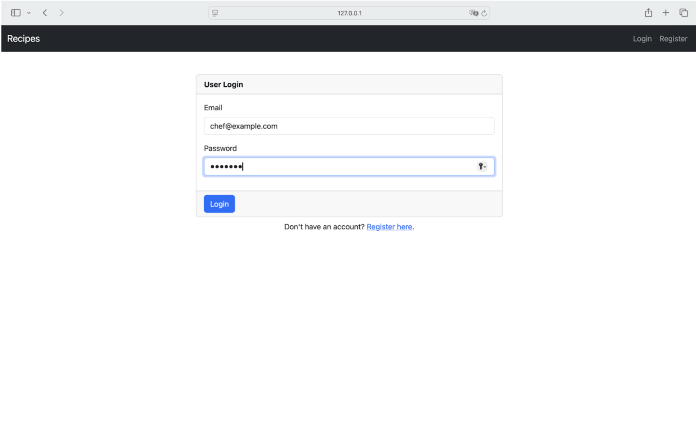
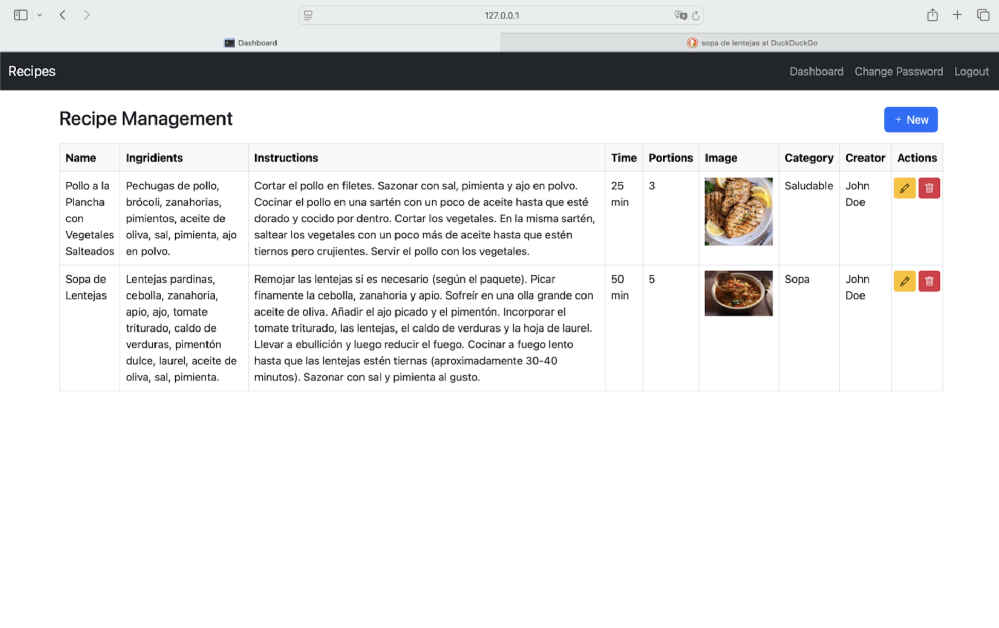
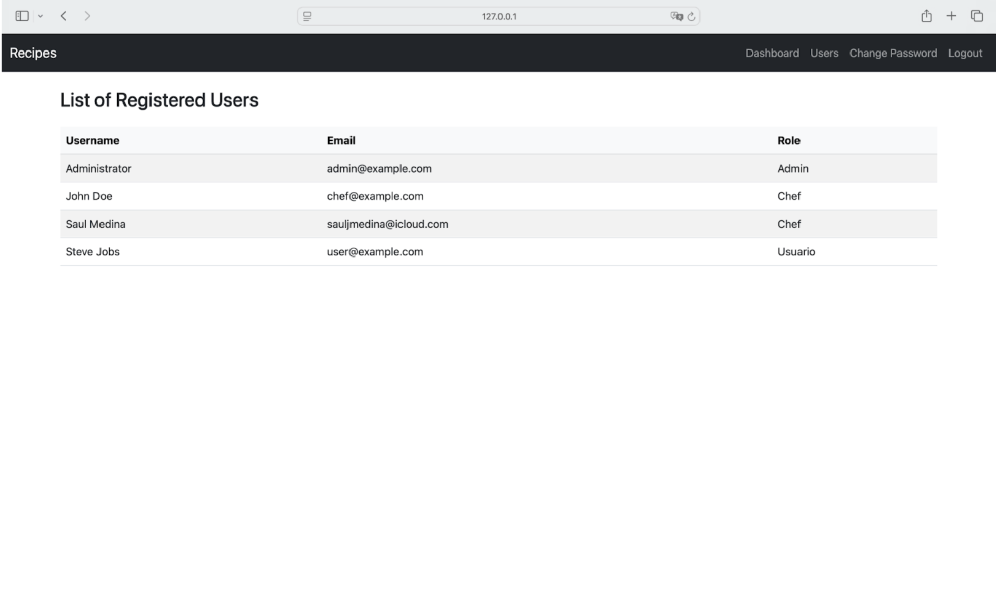

# 🎓 Gestión de Recetas - Flask + MySQL

Este proyecto permite gestionar recetas donde **chefs** pueden crear recetas, y **usuarios** pueden visualizarlos. Además, los **administradores** pueden gestionar usuarios y roles. Es el Proyecto 10 dentro de una colección de 11 proyectos desarrollados como proyecto final

A continuación, capturas de algunas de la interfaces del front-end del proyecto:

<figure class="image">
   
   <figcaption>Login Page</figcaption>
</figure>

<figure class="image">
   
   <figcaption>Home Page / Dashboard</figcaption>
</figure>

<figure class="image">
   
   <figcaption>Registered Users</figcaption>
</figure>

## 🚀 Tecnologías utilizadas

- **Flask** – Framework backend en Python
- **Flask-Login** – Sistema de autenticación
- **MySQL** – Base de datos relacional
- **SQLAlchemy** – ORM para la base de datos
- **Bootstrap 5** – Framework CSS responsivo
- **Jinja2** – Motor de plantillas para HTML

---

## 📂 Estructura del proyecto

| Archivo / Carpeta                                                 | Descripción                                                                |
| ----------------------------------------------------------------- | -------------------------------------------------------------------------- |
| `create_demo_users.py`                                            | Script para crear usuarios iniciales con roles y contraseñas               |
| `config.py`                                                       | Configuración de Flask (DB URI, claves, etc.)                              |
| `README.md`                                                       | Este archivo de documentación del proyecto                                 |
| `requirements.txt`                                                | Lista de paquetes Python requeridos                                        |
| **`run.py`**                                                      | Punto de entrada para ejecutar el servidor Flask                           |
| `app/__init__.py`                                                 | Inicializa la aplicación Flask y carga la configuración                    |
| `app/models.py`                                                   | Contiene los modelos SQLAlchemy: User, Role, Curso                         |
| `app/forms.py`                                                    | Formularios de Flask-WTF usados en login, registro, cursos, contraseñas    |
| `app/routes.py`                                                   | Rutas principales del proyecto (dashboard, cursos, cambiar contraseña)     |
| `app/auth_routes.py`                                              | Rutas para autenticación (login, registro, logout)                         |
| `app/templates/layout.html`                                       | Plantilla base HTML con barra de navegación                                |
| `app/templates/index.html`                                        | Página de inicio pública del sitio                                         |
| `app/templates/login.html`                                        | Formulario de login de usuario                                             |
| `app/templates/register.html`                                     | Formulario de registro con selección de rol                                |
| `app/templates/dashboard.html`                                    | Panel principal del usuario autenticado                                    |
| `app/templates/receta_form.html`                                   | Formulario de creación/edición de recetas                                   |
| `app/templates/recetas.html`                                       | Vista de recetas creadas por el usuario                                     |
| `app/templates/usuarios.html`                                     | Listado de usuarios con sus roles (solo para admins)                       |
| `app/templates/cambiar_password.html`                             | Formulario para cambiar la contraseña del usuario                          |
| `static/css/styles.css`                                           | Archivo CSS personalizado (opcional)                                       |
| `database_schema/10_recetas.sql`                                   | SQL para crear la base de datos y tablas del proyecto de recetas            |


---

## 🧪 Requisitos previos

- Python 3.8 o superior
- MySQL Server corriendo localmente (`localhost:3306`)
- Un entorno virtual activo (opcional, pero recomendado)

---

## ⚙️ Instalación del proyecto

1. **Clonar el repositorio**

   ```bash
   git clone https://github.com/javierdastas/comp2052.git
   cd comp2052/final_project
   ```

2. **Crear entorno virtual y activarlo**

   ```bash
   python -m venv venv   # En Linux/Windows requiere esto
   ```

   ```bash
   python3 -m venv venv     # En Mac requiere esto
   ```

   > Para activar el virtual environment:

   ```bash
   venv\Scripts\activate.bat  # Solo para Windows
   ```

   ```bash
   source venv/bin/activate   # Solo en Linux/Mac requiere esto
   ```

3. **Instalar dependencias**

   ```bash
   pip install -r requirements.txt
   ```

4. **Crear la base de datos en MySQL**

   > Para ejecutar el archivo SQL para el proyecto directamente en MySQL:

   ```bash
   mysql -u root -p < database_schema/10_recetas.sql
   ```

   ```bash
   10_recetas.sql
   ```

5. **Crear usuarios de prueba**

   ```bash
   python create_demo_users.py
   ```

6. **Ejecutar la aplicación**

   ```bash
   python run.py
   ```

   > Luego abre en tu navegador:

   ```bash
   http://127.0.0.1:5000
   ```

## 👤 Credenciales de prueba

Estas credenciales puedes crearlas utilizano el archivo `create_demo_users.py`. De igual manera puedes modificar el archivo según los roles de tu proyecto.

| Rol        | Usuario       | Email               | Contraseña |
| ---------- | ------------- | ------------------- | ---------- |
| Admin      | Administrator | admin@example.com   | admin123   |
| chef       | John Doe      | chef@example.com    | chef123    |
| Estudiante | Steve Jobs    | user@example.com    | user123    |