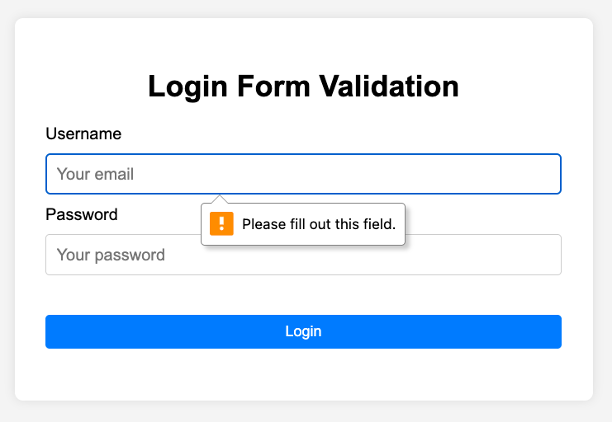

# Login Form App

Una aplicación web para Login, construida con **Flask**, **WTForms**, **Jinja2** y **Bootstrap 5**. Incluye una REST API integrada y una interfaz web responsiva que permite entrar y validar el login de un usuario.

Las reglas de validación de los datos para el **Username** y el **Password** se define el código del servidor **app.py** utilizando la librería **WTForms**.

---

## 🚀 Tecnologías utilizadas

- [Flask](https://flask.palletsprojects.com/) – Is a lightweight WSGI web application framework.
- [Jinja2](https://jinja.palletsprojects.com/) – Is a fast, expressive, extensible templating engine for web pages allow writing code similar to Python syntax.
- [wtforms](https://jinja.palletsprojects.com/) – Flexible forms validation and rendering library for Python web development.
- [Bootstrap 5](https://getbootstrap.com/) – Framework CSS para diseño moderno y responsivo
- HTML5, CSS3, JavaScript (mínimo)

---
